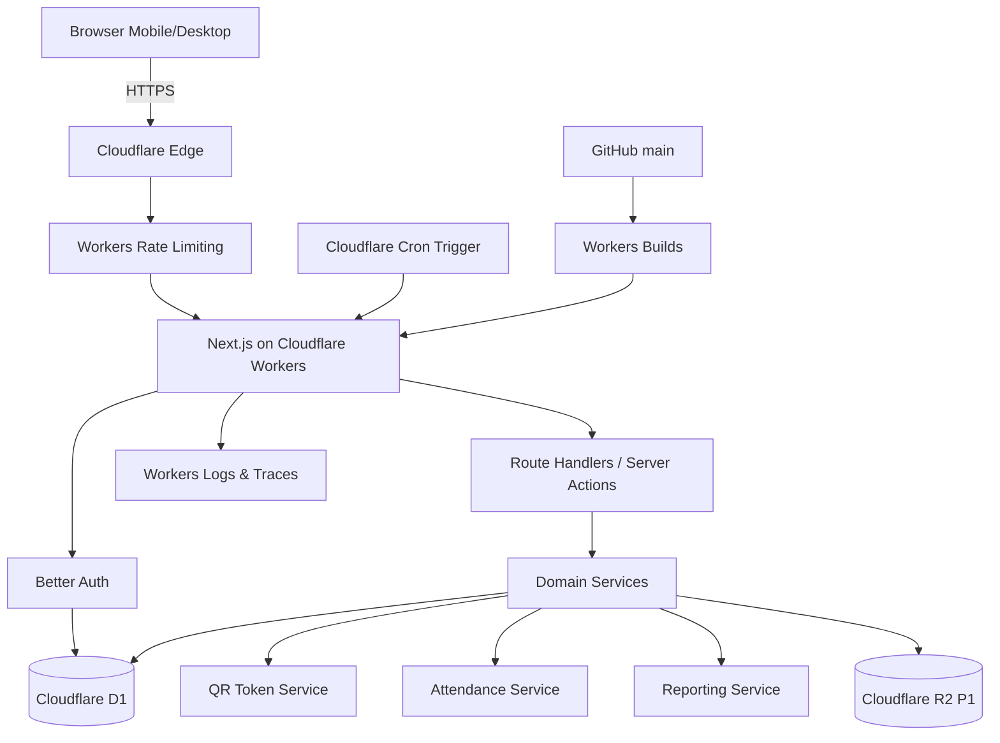
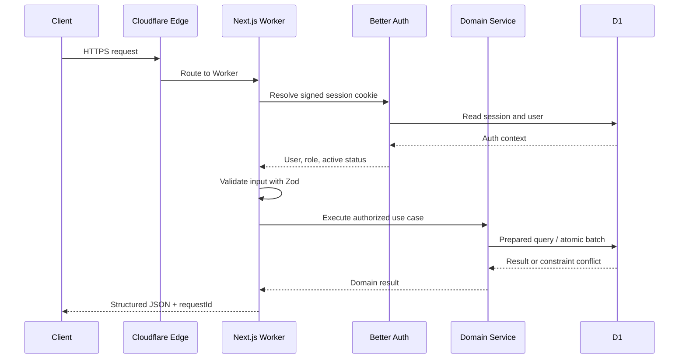
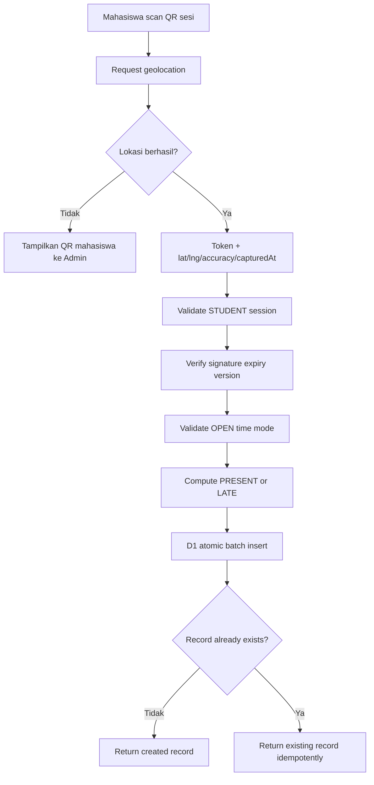
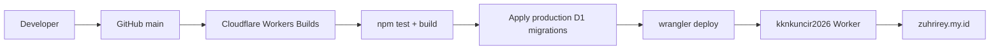

# ARCHITECTURE — kkndesakuncir

**Document Version**: 1.2.0  
**Last Updated**: 2026-07-31  
**Status**: Approved Cloudflare Baseline

## 1. Architecture Goals

- Satu codebase yang mudah dieksekusi oleh Claude Code atau Codex.
- Seluruh runtime produksi berada di Cloudflare; tidak memakai Vercel atau Supabase.
- Mobile-first untuk kamera, QR Code, dan browser geolocation.
- Aman terhadap duplikasi, replay QR, manipulasi role, dan akses data langsung dari browser.
- Biaya serta kompleksitas operasional rendah untuk satu kelompok KKN.
- Memiliki jalur pengembangan menuju multi-kelompok tanpa rewrite total.

## 2. Architecture Decision Summary

| Area | Keputusan |
|---|---|
| Application runtime | Next.js App Router di Cloudflare Workers melalui OpenNext |
| Static assets | Workers Static Assets |
| Database | Cloudflare D1, binding `DB` |
| ORM / migrations | Drizzle ORM + SQL migrations |
| Authentication | Better Auth dengan D1 adapter, Username plugin, dan Admin plugin |
| File storage | Cloudflare R2 binding `ATTACHMENTS` untuk bukti izin/sakit P1 |
| Scheduler | Cron Trigger per jam, idempotent |
| Abuse protection | Cloudflare Workers Rate Limiting bindings |
| Logs | Workers Logs, Traces, dan structured application logs |
| CI/CD | Workers Builds terhubung ke GitHub branch `main` |
| Production domain | `https://zuhrirey.my.id` |
| Repository | `https://github.com/syihab-zuhri/kknkuncir2026.git` |

> 💡 Reasoning: Cloudflare Workers + OpenNext mempertahankan pengalaman full-stack Next.js tanpa memerlukan server terpisah. D1 cukup untuk skala satu kelompok dan menghilangkan kebutuhan layanan database eksternal.

## 3. High-Level Architecture



> 💡 Reasoning: Modular monolith dipilih karena service terpisah belum memberi manfaat pada skala satu kelompok. Boundary domain tetap dibuat agar logika tidak bercampur dan dapat dipisahkan di masa depan.

## 4. Cloudflare Resources

| Resource | Production Name | Binding / Usage |
|---|---|---|
| Worker | `kknkuncir2026` | Runtime aplikasi |
| D1 database | `kknkuncir2026-db` | `DB` |
| Preview D1 | `kknkuncir2026-preview-db` | Preview/non-production |
| R2 bucket P1 | `kknkuncir2026-attachments` | `ATTACHMENTS` |
| Rate limiter login | Wrangler config | `LOGIN_RATE_LIMITER` |
| Rate limiter self-scan | Wrangler config | `SELF_SCAN_RATE_LIMITER` |
| Rate limiter admin-scan | Wrangler config | `ADMIN_SCAN_RATE_LIMITER` |
| Rate limiter admin mutation | Wrangler config | `ADMIN_MUTATION_RATE_LIMITER` |
| Cron | `5 * * * *` | Generator sesi harian + auto-close |
| Custom Domain | `zuhrirey.my.id` | Apex production route |

## 5. Application Modules

```text
src/
├── app/
│   ├── (public)/login/
│   ├── admin/
│   ├── student/
│   └── api/v1/
├── components/
│   ├── ui/
│   ├── qr/
│   ├── attendance/
│   └── reports/
├── modules/
│   ├── auth/
│   ├── group/
│   ├── students/
│   ├── sessions/
│   ├── qr-attendance/
│   ├── corrections/
│   └── reporting/
├── db/
│   ├── schema/
│   ├── migrations/
│   ├── client.ts
│   └── repositories/
├── lib/
│   ├── auth/
│   ├── cloudflare/
│   ├── security/
│   ├── validation/
│   ├── observability/
│   └── time/
├── worker/
│   └── scheduled.ts
└── types/
```

Setiap module minimal memiliki:

- `schema.ts` — Zod input/output schemas.
- `service.ts` — business rules dan use cases.
- `repository.ts` — akses D1 melalui Drizzle.
- `errors.ts` — stable domain error codes.
- `*.test.ts` — unit atau integration tests.

## 6. Request Lifecycle



### Mandatory Request Rules

1. Browser tidak pernah menerima D1 credentials atau binding.
2. Semua mutation memverifikasi session pada server.
3. Semua Admin endpoint memverifikasi `role = ADMIN` dan status akun aktif.
4. Semua Mahasiswa read query dibatasi dengan `student.user_id = currentUser.id`.
5. Input tidak dipercaya meskipun berasal dari hidden field atau URL param.
6. Timestamp kehadiran memakai waktu server, bukan waktu perangkat.

## 7. Authentication Architecture

### 7.1 Better Auth

- Adapter menggunakan D1 binding `DB`.
- Login utama Mahasiswa menggunakan Username plugin dengan NIM sebagai username.
- Admin plugin digunakan untuk create user, set role, reset credential, ban/unban, dan session revocation. Konfigurasikan custom access-control roles `ADMIN` dan `STUDENT`, dengan `STUDENT` sebagai default dan hanya `ADMIN` memperoleh administrative permissions.
- Session disimpan di D1 dan dikirim sebagai secure HTTP-only cookie.
- Public registration dinonaktifkan.

### 7.2 Internal Email Strategy

Better Auth tetap membutuhkan identity email pada beberapa flow. Karena Mahasiswa login dengan NIM dan belum tentu memiliki email:

```text
<NIM>@users.zuhrirey.my.id
```

Alamat tersebut:

- dibuat server saat Admin membuat akun;
- tidak ditampilkan sebagai kanal komunikasi;
- tidak menerima email;
- tidak boleh digunakan untuk password recovery publik;
- reset password dilakukan Admin dan menghasilkan password sementara.

> 💡 Reasoning: Pola internal email menjaga kompatibilitas auth library tanpa memaksa pengumpulan email pribadi yang tidak diperlukan.

## 8. Authorization Model

D1 tidak menyediakan PostgreSQL Row Level Security. Kontrol akses diterapkan berlapis:

1. **Route layer** — mengecek session dan role.
2. **Service layer** — memverifikasi aturan bisnis dan ownership.
3. **Repository layer** — query ownership selalu menyertakan `user_id` atau `student_id` dari server auth context.
4. **Database constraints** — unique, foreign key, and check constraints; audit writes are atomic application batches.
5. **Security tests** — IDOR dan privilege escalation wajib diuji.

Contoh repository Mahasiswa:

```ts
return db
  .select()
  .from(attendanceRecords)
  .innerJoin(students, eq(students.id, attendanceRecords.studentId))
  .where(and(
    eq(attendanceRecords.id, attendanceId),
    eq(students.userId, auth.user.id)
  ));
```

> 💡 Reasoning: Jangan mengambil record berdasarkan `attendanceId` lalu mengecek ownership belakangan. Scope ownership harus menjadi bagian query agar tidak terjadi accidental data exposure.

## 9. QR Token Architecture

### 9.1 Session QR

Minimal signed claims:

```json
{
  "typ": "attendance_session",
  "sid": "session-id",
  "ver": 1,
  "nonce": "random-value",
  "iat": 0,
  "exp": 0
}
```

Rules:

- Ditandatangani menggunakan `QR_SIGNING_SECRET` yang tersimpan sebagai Worker secret.
- Tidak mengandung nama kegiatan, NIM, atau data pribadi.
- `ver` harus sama dengan `attendance_sessions.qr_version`.
- Default TTL MVP adalah 5 menit.
- QR dinamis diperbarui sebelum token kedaluwarsa.
- Admin dapat rotate `qr_version` untuk membatalkan seluruh token lama.

### 9.2 Student QR

- Client menerima opaque random token.
- D1 hanya menyimpan SHA-256 hash token.
- Token dapat dirotasi Admin.
- Admin scan mengirim token ke Worker; Worker hash lalu lookup credential aktif.
- QR tidak menyimpan NIM dalam plain text.

## 10. Self-Scan Data Flow



Location rules:

- Geolocation wajib untuk self-scan.
- Sistem menyimpan latitude, longitude, accuracy, dan capture timestamp.
- Tidak ada geofence/radius pada MVP.
- Lokasi adalah bukti kontekstual dan dapat ditinjau Admin.
- Penolakan izin lokasi tidak menghasilkan attendance; gunakan Admin scan fallback.

## 11. Admin Scan Data Flow

1. Admin memilih satu sesi aktif.
2. Scanner browser membaca token QR Mahasiswa.
3. Worker memvalidasi Admin, status sesi, attendance mode, dan credential Mahasiswa.
4. D1 membuat attendance record dengan waktu server dan `location_status = NOT_REQUIRED`.
5. Unique constraint `(session_id, student_id)` mencegah duplikasi.
6. UI memberi success/error feedback dan debounce token yang sama.

## 12. D1 Transactions and Atomicity

### 12.1 Attendance Insert

Gunakan `env.DB.batch()` untuk operasi yang harus berhasil atau gagal bersama:

1. insert attendance record;
2. insert audit/event log bila diperlukan;
3. update counters hanya jika nanti ditambahkan.

Unique constraint adalah sumber kebenaran untuk idempotensi. Jika conflict terjadi, service mengambil record existing dan mengembalikan hasil deterministic.

### 12.2 Correction

1. Client mengirim `expectedRevision`; server mengambil actor dari authenticated Admin.
2. Service membaca current state untuk membentuk sanitized before/after JSON.
3. `DB.batch()` menjalankan optimistic update dan conditional audit insert secara berurutan.
4. Audit insert hanya terjadi bila record cocok dengan revision baru, mutation timestamp, dan `updated_by` actor.
5. Bila update affected rows = 0, return `409 CONCURRENT_UPDATE`.

> 💡 Reasoning: D1 batch menjamin statements di batch berjalan sebagai transaction. Conditional audit insert menjaga audit konsisten tanpa database trigger yang berisiko membuat duplicate audit dan tidak memiliki request reason/actor context.

## 13. Caching Strategy

| Data | Cache | TTL | Invalidation |
|---|---|---:|---|
| Versioned static assets | Cloudflare edge | immutable | deployment |
| Group settings | Worker cache/in-memory request | maksimal 5 menit | mutation group settings |
| Active sessions | client refetch | 10–15 detik | session mutation |
| Live attendance list/count | no shared cache | none | mutation/refetch |
| Student personal history | private/no-store | none | attendance mutation |
| Report export | request scoped MVP | none | n/a |

Attendance dan user-specific API wajib mengirim `Cache-Control: private, no-store`.

## 14. Scheduled Jobs

Cron expression:

```text
5 * * * *
```

Setiap eksekusi:

1. Hitung tanggal bisnis berdasarkan `Asia/Jakarta`.
2. Periksa periode KKN aktif.
3. Buat sesi `DAILY` bila belum ada untuk tanggal tersebut.
4. Tutup sesi yang melewati `ends_at`.
5. Tulis structured log hasil job.

Unique partial index sesi harian memastikan job idempotent. Cron bukan kontrol keamanan; setiap submission tetap memvalidasi waktu sesi.

## 15. Rate Limiting

| Action | Key | Initial Policy |
|---|---|---|
| Login | normalized identifier hash | 5 attempts / minute |
| Self-scan | user ID + session ID | 10 requests / minute |
| Admin scan | admin ID + session ID | 120 requests / minute |
| Generate/rotate session QR | admin ID + session ID | 30 requests / minute |
| CSV import | admin ID | 5 requests / minute |

Rate limiter adalah defense-in-depth; unique constraints dan authorization tetap wajib. Gunakan identifier aplikasi yang stabil sebagai key. Jangan menjadikan alamat IP sebagai key utama karena jaringan seluler/NAT dapat dipakai bersama banyak pengguna.

## 16. Error Contract

```json
{
  "error": {
    "code": "SESSION_CLOSED",
    "message": "Sesi absensi tidak sedang dibuka.",
    "requestId": "request-id",
    "details": null
  }
}
```

Rules:

- `code` stabil untuk UI dan automated tests.
- `message` aman ditampilkan ke pengguna.
- Validation details hanya memuat field yang relevan.
- Stack trace tidak pernah dikirim ke browser.

## 17. Logging and Monitoring

Structured fields:

- `timestamp`
- `level`
- `request_id`
- `route`
- `method`
- `actor_id` bila tersedia
- `role` bila tersedia
- `event`
- `duration_ms`
- `status_code`
- `session_id` untuk attendance event

Rules:

- Jangan log password, cookie, raw QR token, full signing token, atau precise location secara default.
- Location hanya ada di D1 dan aksesnya Admin-only.
- Aktifkan Workers Logs dan Traces.
- Source maps di-upload saat deploy.
- Alert operasional awal: lonjakan 5xx, login 429, cron gagal, dan D1 error.

## 18. Deployment Architecture



Deployment details dan rollback ada di `DEPLOYMENT.md`.

## 19. Wrangler Baseline

```jsonc
{
  "$schema": "./node_modules/wrangler/config-schema.json",
  "name": "kknkuncir2026",
  "main": ".open-next/worker.js",
  "compatibility_date": "2026-07-30",
  "compatibility_flags": ["nodejs_compat"],
  "assets": {
    "directory": ".open-next/assets",
    "binding": "ASSETS"
  },
  "d1_databases": [
    {
      "binding": "DB",
      "database_name": "kknkuncir2026-db",
      "database_id": "<D1_DATABASE_ID>",
      "preview_database_id": "<PREVIEW_D1_DATABASE_ID>",
      "migrations_dir": "drizzle",
      "migrations_pattern": "drizzle/**/*.sql"
    }
  ],
  "ratelimits": [
    {
      "name": "LOGIN_RATE_LIMITER",
      "namespace_id": "1001",
      "simple": { "limit": 5, "period": 60 }
    },
    {
      "name": "SELF_SCAN_RATE_LIMITER",
      "namespace_id": "1002",
      "simple": { "limit": 10, "period": 60 }
    },
    {
      "name": "ADMIN_SCAN_RATE_LIMITER",
      "namespace_id": "1003",
      "simple": { "limit": 120, "period": 60 }
    },
    {
      "name": "ADMIN_MUTATION_RATE_LIMITER",
      "namespace_id": "1004",
      "simple": { "limit": 30, "period": 60 }
    }
  ],
  "routes": [
    {
      "pattern": "zuhrirey.my.id",
      "custom_domain": true
    }
  ],
  "observability": {
    "enabled": true,
    "logs": { "enabled": true, "invocation_logs": true },
    "traces": { "enabled": true, "head_sampling_rate": 0.05 }
  },
  "upload_source_maps": true
}
```

> 💡 Reasoning: `wrangler.jsonc` menjadi source of truth untuk resource bindings dan deployment. Dashboard Cloudflare tidak boleh menjadi satu-satunya tempat konfigurasi karena sulit direview dan direproduksi.

Phase 0 mengimplementasikan top-level Wrangler sebagai production Worker bernama persis `kknkuncir2026` dan named environment `preview` sebagai Worker terpisah. Karena bindings dan `vars` tidak diwariskan ke named environment, konfigurasi preview mendeklarasikan ulang seluruh binding dengan D1 `kknkuncir2026-preview-db`; script preview selalu memakai `--env preview`.

`compatibility_date` dipin ke `2026-07-30`, yaitu tanggal terbaru yang didukung `workerd` yang terkunci bersama Wrangler 4.118.0. D1 production dan preview dibuat terpisah di region hint APAC; `database_id` aktual disimpan sebagai resource identifier pada Wrangler, bukan sebagai credential. `preview_database_id` top-level dan binding named environment preview sama-sama menunjuk D1 preview.

Rate limiter pada Phase 0 baru berupa deklarasi binding. Pemanggilan binding tetap mengikuti phase fitur terkait. Cron sengaja tidak diaktifkan pada Phase 0 karena entrypoint belum memiliki scheduled handler; trigger `5 * * * *` baru ditambahkan bersama implementasi dan pengujian Phase 3 agar deployment baseline tidak menghasilkan invocation gagal.

## 20. Security Baseline

- HTTPS only melalui Cloudflare.
- Secure HTTP-only session cookies.
- CSRF/origin validation pada state-changing requests.
- Password hashing ditangani Better Auth.
- QR secrets tersimpan melalui `wrangler secret`, bukan Git.
- Prepared statements/Drizzle untuk seluruh D1 query.
- Strict input validation dengan Zod.
- Output encoding dan React escaping.
- Content Security Policy bertahap; kamera dan geolocation hanya origin sendiri.
- Dependency audit dijalankan pada CI.
- Backup/rollback memakai D1 Time Travel dan deployment version rollback.

## 21. Rejected Alternatives

| Alternative | Status | Alasan |
|---|---|---|
| Cloudflare Pages static export | Rejected | Tidak sesuai kebutuhan full-stack auth, D1, route handlers, dan Cron |
| Separate Node server/VPS | Rejected MVP | Operasional lebih berat untuk satu kelompok |
| External hosted database | Rejected baseline | User meminta Cloudflare-only dan D1 memadai untuk target scale |
| Native Android app | Rejected MVP | Responsive web lebih cepat dan cukup untuk QR/geolocation |
| Microservices | Rejected MVP | Menambah complexity tanpa kebutuhan scale |

## 22. Official References

- https://developers.cloudflare.com/workers/framework-guides/web-apps/nextjs/
- https://developers.cloudflare.com/d1/
- https://developers.cloudflare.com/d1/reference/migrations/
- https://developers.cloudflare.com/r2/api/workers/workers-api-usage/
- https://developers.cloudflare.com/workers/ci-cd/builds/
- https://developers.cloudflare.com/workers/configuration/routing/custom-domains/
- https://developers.cloudflare.com/workers/configuration/cron-triggers/
- https://developers.cloudflare.com/workers/observability/logs/workers-logs/
- https://www.better-auth.com/docs/adapters/drizzle
- https://www.better-auth.com/docs/plugins/username
- https://www.better-auth.com/docs/plugins/admin
