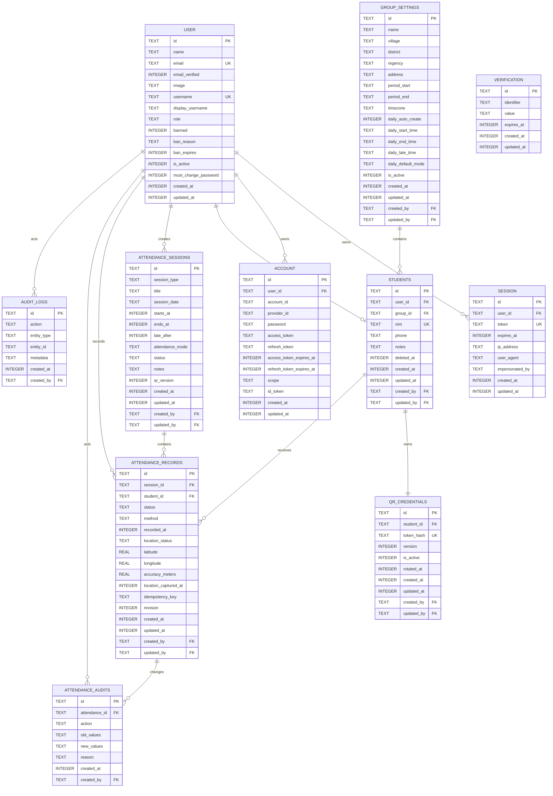

# ERD — Data Model: kkndesakuncir

**Document Version**: 1.1.0  
**Last Updated**: 2026-07-31  
**Status**: Approved Cloudflare Baseline  
**Database**: Cloudflare D1 (SQLite semantics)  
**ORM**: Drizzle ORM

## 1. D1 Type Conventions

| Logical Type | D1 Storage | Convention |
|---|---|---|
| UUID / ID | `TEXT` | Generated in application with `crypto.randomUUID()` |
| Boolean | `INTEGER` | `0` or `1` with check constraint |
| Timestamp | `INTEGER` | Unix epoch milliseconds in UTC |
| Calendar date | `TEXT` | ISO `YYYY-MM-DD` |
| Time-of-day | `TEXT` | `HH:mm:ss` in group timezone |
| Enum | `TEXT` | Protected with check constraint |
| JSON | `TEXT` | Valid JSON string, parsed by application |
| Coordinates | `REAL` | Latitude/longitude/accuracy |

> 💡 Reasoning: D1 mengikuti SQLite type system. Konvensi eksplisit menghindari asumsi PostgreSQL seperti `uuid`, `timestamptz`, `jsonb`, atau native enum.

## 2. Entity Relationship Diagram



## 3. Better Auth Tables

Better Auth schema harus dihasilkan dari konfigurasi auth final, kemudian direview sebelum migration diterapkan. Tabel utama:

- `user`
- `session`
- `account`
- `verification`

Plugin menambahkan field:

- Username plugin: `username`, `display_username`.
- Admin plugin: `role`, `banned`, `ban_reason`, `ban_expires`, `impersonated_by` pada schema yang relevan. Plugin dikonfigurasi dengan custom roles `ADMIN` dan `STUDENT`, bukan default lowercase roles.
- Custom fields: `is_active`, `must_change_password`.

> 💡 Reasoning: Schema auth jangan ditulis ulang secara manual tanpa mencocokkan versi Better Auth yang dipasang. Generated schema adalah sumber kebenaran untuk kolom auth library.

## 4. Application Tables

### 4.1 `group_settings`

Hanya satu active group pada MVP.

| Column | Type | Null | Rules |
|---|---|---:|---|
| `id` | TEXT | No | PK |
| `name` | TEXT | No | Default `KKN Desa Kuncir 2026` |
| `village` | TEXT | Yes | |
| `district` | TEXT | Yes | |
| `regency` | TEXT | Yes | |
| `address` | TEXT | Yes | |
| `period_start` | TEXT | No | ISO date |
| `period_end` | TEXT | No | `period_end >= period_start` |
| `timezone` | TEXT | No | Default `Asia/Jakarta` |
| `daily_auto_create` | INTEGER | No | `0/1` |
| `daily_start_time` | TEXT | No | `HH:mm:ss` |
| `daily_end_time` | TEXT | No | `HH:mm:ss` |
| `daily_late_time` | TEXT | Yes | `HH:mm:ss` |
| `daily_default_mode` | TEXT | No | `SELF_SCAN`, `ADMIN_SCAN`, `HYBRID` |
| `is_active` | INTEGER | No | `0/1` |
| audit fields | INTEGER/TEXT | No | `created_at`, `updated_at`, `created_by` |

### 4.2 `students`

| Column | Type | Null | Rules |
|---|---|---:|---|
| `id` | TEXT | No | PK |
| `user_id` | TEXT | No | FK `user.id`, unique |
| `group_id` | TEXT | No | FK `group_settings.id` |
| `nim` | TEXT | No | Unique; keep as text for leading zero |
| `phone` | TEXT | Yes | |
| `notes` | TEXT | Yes | Max enforced by app |
| `deleted_at` | INTEGER | Yes | Soft delete |
| audit fields | INTEGER/TEXT | No | `created_at`, `updated_at`, `created_by`, `updated_by` on mutable application tables |

### 4.3 `qr_credentials`

| Column | Type | Null | Rules |
|---|---|---:|---|
| `id` | TEXT | No | PK |
| `student_id` | TEXT | No | FK, unique active credential per student |
| `token_hash` | TEXT | No | Unique SHA-256 hex/base64url |
| `version` | INTEGER | No | Starts at 1 |
| `is_active` | INTEGER | No | `0/1` |
| `rotated_at` | INTEGER | Yes | |
| audit fields | INTEGER/TEXT | No | `created_at`, `updated_at`, `created_by`, `updated_by` on mutable application tables |

### 4.4 `attendance_sessions`

| Column | Type | Null | Rules |
|---|---|---:|---|
| `id` | TEXT | No | PK |
| `session_type` | TEXT | No | `DAILY`, `EVENT` |
| `title` | TEXT | No | 1–120 chars |
| `session_date` | TEXT | No | ISO date in business timezone |
| `starts_at` | INTEGER | No | UTC epoch ms |
| `ends_at` | INTEGER | No | `ends_at > starts_at` |
| `late_after` | INTEGER | Yes | Between start and end |
| `attendance_mode` | TEXT | No | Allowed mode |
| `status` | TEXT | No | `DRAFT`, `OPEN`, `CLOSED`, `CANCELLED` |
| `notes` | TEXT | Yes | |
| `qr_version` | INTEGER | No | Default 1 |
| audit fields | INTEGER/TEXT | No | `created_at`, `updated_at`, `created_by`, `updated_by` on mutable application tables |

### 4.5 `attendance_records`

| Column | Type | Null | Rules |
|---|---|---:|---|
| `id` | TEXT | No | PK |
| `session_id` | TEXT | No | FK |
| `student_id` | TEXT | No | FK |
| `status` | TEXT | No | `PRESENT`, `LATE`, `SICK`, `PERMITTED`, `ABSENT` |
| `method` | TEXT | No | `SELF_SCAN`, `ADMIN_SCAN`, `MANUAL` |
| `recorded_at` | INTEGER | No | Server time |
| `location_status` | TEXT | No | `CAPTURED`, `NOT_REQUIRED`, `UNAVAILABLE` |
| `latitude` | REAL | Yes | Required for self-scan |
| `longitude` | REAL | Yes | Required for self-scan |
| `accuracy_meters` | REAL | Yes | Non-negative |
| `location_captured_at` | INTEGER | Yes | Client capture timestamp |
| `idempotency_key` | TEXT | Yes | Unique when present |
| `revision` | INTEGER | No | Starts 1, increments on update |
| audit fields | INTEGER/TEXT | No | `created_at`, `updated_at`, `created_by`, `updated_by` on mutable application tables |

### 4.6 `attendance_audits`

Append-only history for attendance changes.

| Column | Type | Null | Rules |
|---|---|---:|---|
| `id` | TEXT | No | PK |
| `attendance_id` | TEXT | No | FK |
| `action` | TEXT | No | `CREATE`, `MANUAL_CREATE`, `STATUS_CHANGE` |
| `old_values` | TEXT | Yes | JSON |
| `new_values` | TEXT | No | JSON |
| `reason` | TEXT | Yes | Required for manual/correction |
| `created_at` | INTEGER | No | |
| `created_by` | TEXT | No | FK `user.id` |

### 4.7 `audit_logs`

Untuk tindakan administratif non-attendance: account creation, reset password, deactivate user, rotate QR, settings update, export.

## 5. Check Constraints

```sql
CHECK (role IN ('ADMIN', 'STUDENT'))
CHECK (session_type IN ('DAILY', 'EVENT'))
CHECK (attendance_mode IN ('SELF_SCAN', 'ADMIN_SCAN', 'HYBRID'))
CHECK (status IN ('DRAFT', 'OPEN', 'CLOSED', 'CANCELLED'))
CHECK (method IN ('SELF_SCAN', 'ADMIN_SCAN', 'MANUAL'))
CHECK (location_status IN ('CAPTURED', 'NOT_REQUIRED', 'UNAVAILABLE'))
CHECK (revision >= 1)
CHECK (latitude IS NULL OR latitude BETWEEN -90 AND 90)
CHECK (longitude IS NULL OR longitude BETWEEN -180 AND 180)
CHECK (accuracy_meters IS NULL OR accuracy_meters >= 0)
```

## 6. Critical Indexes and Constraints

```sql
CREATE UNIQUE INDEX ux_students_user_id
ON students(user_id);

CREATE UNIQUE INDEX ux_students_nim_active
ON students(nim)
WHERE deleted_at IS NULL;

CREATE UNIQUE INDEX ux_attendance_session_student
ON attendance_records(session_id, student_id);

CREATE UNIQUE INDEX ux_attendance_idempotency
ON attendance_records(idempotency_key)
WHERE idempotency_key IS NOT NULL;

CREATE UNIQUE INDEX ux_daily_session_date
ON attendance_sessions(session_date)
WHERE session_type = 'DAILY' AND status != 'CANCELLED';

CREATE INDEX ix_sessions_date_status
ON attendance_sessions(session_date, status);

CREATE INDEX ix_records_student_recorded
ON attendance_records(student_id, recorded_at DESC);

CREATE INDEX ix_records_session_status
ON attendance_records(session_id, status);

CREATE INDEX ix_audits_attendance_created
ON attendance_audits(attendance_id, created_at DESC);
```

> 💡 Reasoning: Unique `(session_id, student_id)` adalah proteksi final terhadap double attendance, termasuk race condition dan request retry.

## 7. Atomic Audit Strategy

Attendance correction menggunakan satu `DB.batch()` dengan statements berurutan:

1. `UPDATE attendance_records` memakai `WHERE id = ? AND revision = ?`;
2. update mengisi `revision = revision + 1`, `updated_at`, dan `updated_by`;
3. `INSERT attendance_audits ... SELECT ...` hanya berjalan bila record sekarang cocok dengan revision baru, timestamp mutation, dan actor yang diharapkan;
4. service memeriksa metadata hasil update; bila zero rows, return `409 CONCURRENT_UPDATE`.

Pseudo-SQL:

```sql
UPDATE attendance_records
SET
  status = ?,
  revision = revision + 1,
  updated_at = ?,
  updated_by = ?
WHERE id = ? AND revision = ?;

INSERT INTO attendance_audits (
  id, attendance_id, action, old_values, new_values,
  reason, created_at, created_by
)
SELECT ?, ?, 'STATUS_CHANGE', ?, ?, ?, ?, ?
WHERE EXISTS (
  SELECT 1
  FROM attendance_records
  WHERE id = ?
    AND revision = ?
    AND updated_at = ?
    AND updated_by = ?
);
```

> 💡 Reasoning: Conditional audit insert mencegah audit palsu ketika optimistic update gagal, sedangkan `DB.batch()` memastikan statements yang benar-benar gagal akan me-roll back keseluruhan batch. Audit tidak memakai database trigger agar satu correction tidak membuat dua audit row dan agar alasan/actor berasal dari authenticated request context.

Direct writes ke `attendance_records` di luar repository correction dilarang oleh coding standard dan diuji melalui repository-level integration tests.

## 8. Soft Delete Strategy

- `students.deleted_at` dipakai agar history attendance tetap utuh.
- User dinonaktifkan melalui `user.is_active = 0` atau Admin plugin ban.
- Attendance, audit, dan session tidak di-hard-delete melalui aplikasi.
- Sesi yang salah dibatalkan dengan `status = CANCELLED`.

## 9. Foreign Key Rules

- Aktifkan foreign key enforcement pada migration/test.
- Hindari cascade delete terhadap attendance history.
- `students.user_id` dan attendance relations menggunakan `ON DELETE RESTRICT` atau `NO ACTION`.
- Session auth boleh dibersihkan sesuai Better Auth lifecycle.

## 10. Authorization Implication

D1 tidak memiliki RLS. Seluruh query private harus melalui Worker:

- Admin: dapat mengakses seluruh data kelompok tunggal.
- Mahasiswa: query selalu di-scope ke `students.user_id = authenticatedUser.id`.
- Browser tidak memiliki database binding atau token akses database.

## 11. Migration Rules

- Migration SQL tersimpan di `drizzle/` dan committed ke Git.
- Migration bersifat forward-only; jangan edit migration yang sudah production.
- Apply local/preview sebelum production.
- Backup bookmark/time travel dicatat sebelum migration berisiko.
- Better Auth generated schema harus sinkron dengan version package terkunci.
