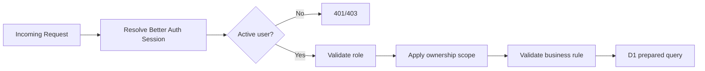

# PERMISSION — Access Control: kkndesakuncir

**Document Version**: 1.1.0  
**Last Updated**: 2026-07-31  
**Status**: Approved Cloudflare Baseline

## 1. Roles

| Role | Description |
|---|---|
| `ADMIN` | Admin atau ketua KKN yang mengelola seluruh sistem kelompok tunggal |
| `STUDENT` | Mahasiswa yang hanya mengakses profil dan data kehadirannya sendiri |

Tidak ada role ketiga pada MVP.

## 2. RBAC Matrix

Legend: `✅ Full`, `👁️ Read`, `🔒 Own Only`, `❌ None`.

| Capability | Admin | Student |
|---|---:|---:|
| Login/logout/change own password | ✅ | ✅ |
| Create/import student account | ✅ | ❌ |
| Reset/deactivate student account | ✅ | ❌ |
| View all students | ✅ | ❌ |
| View own profile | ✅ | 🔒 Own Only |
| Edit group settings | ✅ | ❌ |
| View group information | ✅ | 👁️ Read |
| Create/edit/open/close/cancel sessions | ✅ | ❌ |
| View active sessions | ✅ | 👁️ Read |
| Generate/display session QR | ✅ | ❌ |
| Rotate session QR | ✅ | ❌ |
| Show own student QR | ❌ | 🔒 Own Only |
| Rotate student QR | ✅ | ❌ |
| Self-scan session QR | ❌ | 🔒 Own Only |
| Scan student QR | ✅ | ❌ |
| Manual attendance | ✅ | ❌ |
| Correct attendance | ✅ | ❌ |
| View attendance audit | ✅ | ❌ |
| View all attendance | ✅ | ❌ |
| View own attendance history | ❌ | 🔒 Own Only |
| Export full report | ✅ | ❌ |
| View precise location | ✅ | ❌ |
| View system audit log | ✅ | ❌ |

## 3. Authorization Layers



- Middleware/layout guard membantu UX, tetapi bukan security boundary final.
- Route handler/server action wajib mengulangi authorization.
- Service menerima `AuthContext`, bukan role dari request body.
- Repository Mahasiswa wajib menyertakan authenticated `user.id` pada query.

## 4. Row Ownership Rules

D1 tidak menyediakan Row Level Security. Aturan berikut wajib diterapkan pada server:

### Student Profile

```text
students.user_id = auth.user.id
AND students.deleted_at IS NULL
AND user.is_active = 1
```

### Student Attendance

```text
attendance_records.student_id IN (
  SELECT id FROM students WHERE user_id = auth.user.id
)
```

### Student QR Credential

Mahasiswa hanya dapat meminta opaque QR token miliknya melalui endpoint server. Hash token tidak pernah dikirim ke client.

### Admin Scope

Karena MVP hanya satu kelompok, Admin memiliki akses seluruh data aplikasi. Model tetap menyimpan `group_id` untuk future-proofing.

> 💡 Reasoning: Ownership disisipkan ke query, bukan diperiksa setelah record diambil. Ini mengurangi risiko IDOR akibat developer lupa melakukan post-check.

## 5. Endpoint Permission Matrix

| Endpoint Pattern | Allowed |
|---|---|
| `/api/v1/auth/*` | Public/Authenticated sesuai action |
| `/api/v1/admin/*` | `ADMIN` only |
| `/api/v1/sessions/active` | `ADMIN`, `STUDENT` |
| `/api/v1/attendance/self-scan` | `STUDENT` only |
| `/api/v1/attendance/admin-scan` | `ADMIN` only |
| `/api/v1/attendance/manual` | `ADMIN` only |
| `/api/v1/attendance/:id` GET | Admin atau owning Student |
| `/api/v1/attendance/:id` PATCH | `ADMIN` only |
| `/api/v1/reports/*` | `ADMIN` only, kecuali own summary endpoint |
| `/api/v1/me/*` | Authenticated own user only |

## 6. Session and Token Policy

- Session provider: Better Auth dengan D1 adapter.
- Cookie: `Secure`, `HttpOnly`, `SameSite=Lax` sebagai baseline.
- Production cookie hanya berlaku untuk HTTPS domain aplikasi.
- Session duration baseline: 7 hari dengan rolling refresh sesuai Better Auth config final.
- Password change, account deactivation, atau Admin reset harus revoke session aktif user terkait.
- First login dengan `must_change_password = 1` hanya boleh mengakses change-password/logout.
- Raw session token tidak pernah ditulis ke logs.

## 7. Account Status Rules

Akses ditolak bila salah satu kondisi benar:

- `user.is_active = 0`;
- Better Auth Admin plugin menandai user banned;
- student row soft-deleted;
- password wajib diganti tetapi route bukan allowlist first-login.

## 8. CSRF and Origin Validation

- Gunakan session cookie dan built-in protection Better Auth.
- Semua mutation tambahan memverifikasi `Origin`/`Host` terhadap production origin.
- Jangan menerima wildcard production origin.
- API tidak mendukung credentialed cross-origin request pada MVP.

## 9. Sensitive Data Rules

| Data | Student | Admin | Log |
|---|---:|---:|---:|
| Own name/NIM | Own | All | Identifier hash only where possible |
| Password/hash | ❌ | ❌ | ❌ |
| Raw QR token | Own display only | Scan only | ❌ |
| QR token hash | ❌ | ❌ | ❌ |
| Precise location | ❌ after submit | ✅ | ❌ default |
| Audit history | ❌ | ✅ | Event metadata only |
| Session cookie | Browser protected | Browser protected | ❌ |

## 10. Security Tests Required

- Student cannot call Admin endpoint by modifying frontend.
- Student A cannot read Student B profile/history by changing ID.
- Disabled/banned account cannot use existing session.
- First-login user cannot bypass password change using direct API call.
- Student cannot set role through request payload.
- Admin scan rejects inactive student or rotated QR.
- Self-scan uses authenticated student, not `studentId` supplied by client.
- Audit and location endpoint reject Student access.
