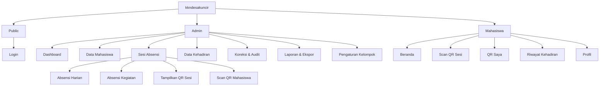

# PLANNING — kkndesakuncir

**Document Version**: 1.1.0  
**Last Updated**: 2026-07-31  
**Status**: Approved Baseline  
**Owner**: System Architect & Project Planner

## 1. Project Overview

`kkndesakuncir` adalah website mobile-first untuk mencatat kehadiran satu kelompok KKN melalui QR Code. Sistem menyediakan dua jenis absensi:

1. **Absensi Harian** — satu slot kehadiran per mahasiswa per tanggal.
2. **Absensi Kegiatan** — satu kehadiran per mahasiswa untuk setiap kegiatan yang dibuat admin.

Terdapat dua role bisnis:

- **Admin**: mengelola akun mahasiswa, sesi, QR, koreksi, dan laporan.
- **Mahasiswa**: melakukan absensi mandiri bila diizinkan, menunjukkan QR pribadi, serta melihat riwayat.

> 💡 Reasoning: Ketua KKN tidak dijadikan role ketiga. Apabila ketua perlu mengelola absensi, akunnya diberi role Admin. Ini menjaga permission model sederhana untuk satu kelompok.

## 2. Objectives

- Mengurangi pencatatan absensi manual dan duplikasi data.
- Memungkinkan admin memilih metode absensi sesuai kondisi lapangan.
- Menyimpan lokasi perangkat mahasiswa ketika absensi mandiri dilakukan.
- Menyediakan jejak audit untuk koreksi atau input manual.
- Menyediakan rekap yang mudah difilter dan diekspor.

## 3. Success Metrics

| KPI | Target MVP |
|---|---:|
| Keberhasilan pencatatan absensi | ≥ 98% percobaan valid |
| Waktu median proses scan sampai sukses | ≤ 3 detik pada koneksi normal |
| Duplikasi absensi pada sesi sama | 0 data duplikat |
| Perubahan manual tanpa audit log | 0 kejadian |
| Waktu pembuatan sesi oleh admin | ≤ 60 detik |
| Kelengkapan lokasi untuk self-scan berhasil | 100% record `SELF_SCAN` memiliki koordinat |

## 4. Scope

### 4.1 MVP — P0

- Login Admin dan Mahasiswa.
- Pembuatan akun mahasiswa oleh Admin.
- Kelola profil kelompok tunggal.
- Absensi harian berulang otomatis setiap hari selama periode KKN, satu slot per tanggal.
- Absensi per kegiatan.
- Mode mahasiswa scan QR sesi.
- Mode admin scan QR mahasiswa.
- Mode hybrid.
- Rekam latitude, longitude, akurasi, dan timestamp lokasi pada self-scan.
- Riwayat absensi mahasiswa.
- Koreksi/manual attendance dengan alasan dan audit log.
- Laporan dan ekspor CSV.

### 4.2 Post-MVP — P1

- Pengajuan izin/sakit dengan lampiran.
- Export XLSX dan PDF.
- Notifikasi sesi aktif.
- Installable PWA dan offline queue terbatas untuk admin scanner.
- QR sesi dinamis yang berotasi otomatis.

### 4.3 Future — P2

- Dukungan multi-kelompok dan multi-periode.
- Integrasi dosen pembimbing.
- Geofencing opsional.
- Dashboard analitik lanjutan.
- Integrasi WhatsApp/email.

## 5. Information Architecture

## 6. Core Attendance Model

### 6.1 Absensi Harian

- Sistem otomatis membuat sesi harian setiap tanggal selama periode KKN berdasarkan jadwal default kelompok.
- Admin dapat membuat manual bila job otomatis gagal dan dapat mengubah jadwal sesi yang belum dibuka.
- Maksimal satu sesi harian non-cancelled per tanggal.
- Satu mahasiswa hanya dapat memiliki satu catatan final pada sesi tersebut.
- Sesi dapat memiliki jendela waktu, misalnya 06:00–23:00.
- Tidak ada check-out pada MVP.

### 6.2 Absensi Kegiatan

- Admin membuat kegiatan bernama dan terjadwal.
- Setiap kegiatan memiliki satu sesi kehadiran.
- Satu mahasiswa hanya dapat tercatat satu kali per kegiatan.
- Kegiatan dapat berlangsung pada hari yang sama dengan absensi harian tanpa konflik.

### 6.3 Metode Absensi

| Metode | Deskripsi |
|---|---|
| `SELF_SCAN` | Mahasiswa login lalu scan QR sesi. Lokasi perangkat wajib berhasil diambil dan direkam. |
| `ADMIN_SCAN` | Admin scan QR pribadi mahasiswa untuk sesi aktif. |
| `MANUAL` | Admin menambah atau mengoreksi data dengan alasan wajib. |

## 7. Visual Direction

### 7.1 Vibe

- Bersih, ramah, lapangan, cepat dipahami.
- Optimistis tanpa terasa terlalu korporat.
- Fokus pada tombol besar dan status yang jelas untuk penggunaan di HP.

### 7.2 Color Palette

| Token | Hex | Penggunaan |
|---|---|---|
| Primary | `#166534` | Tombol utama, header, identitas KKN |
| Primary Soft | `#DCFCE7` | Background status/section |
| Accent | `#F59E0B` | Terlambat/peringatan |
| Success | `#15803D` | Hadir/sukses |
| Danger | `#DC2626` | Gagal/alpa/penghapusan |
| Info | `#2563EB` | Informasi dan link |
| Surface | `#FFFFFF` | Card dan modal |
| Background | `#F8FAFC` | Latar aplikasi |
| Text | `#0F172A` | Teks utama |
| Muted | `#64748B` | Teks sekunder |

### 7.3 Typography

- Font utama: `Inter`, fallback `system-ui, sans-serif`.
- Base size: 16px.
- Minimum target sentuh: 44×44px.

## 8. Recommended Tech Stack

| Layer | Pilihan | Alasan |
|---|---|---|
| Frontend | Next.js App Router + TypeScript | Satu codebase, routing jelas, dan didukung pada Cloudflare Workers melalui OpenNext. |
| UI | Tailwind CSS + komponen aksesibel | Cepat dikembangkan dan konsisten. |
| Runtime / Backend | Cloudflare Workers + `@opennextjs/cloudflare` | Menjalankan SSR, Route Handlers, Server Actions, dan static assets tanpa Vercel. |
| Database | Cloudflare D1 + Drizzle ORM | Relasional berbasis SQLite, binding langsung dari Worker, migration dapat disimpan di Git. |
| Auth | Better Auth + D1 + Admin/Username plugins | Session cookie, login NIM/username, provisioning akun oleh Admin, dan tidak bergantung pada Supabase. |
| Storage | Cloudflare R2 (P1) | Lampiran izin/sakit dan export besar; diakses melalui binding Worker. |
| Scheduler | Cloudflare Cron Triggers | Membuat sesi harian secara idempotent. |
| Rate Limit | Workers Rate Limiting binding | Proteksi login dan endpoint scan tanpa Redis eksternal. |
| Hosting/CDN | Cloudflare Workers Static Assets | Aplikasi dan aset dilayani dari platform Cloudflare. |
| CI/CD | Workers Builds + GitHub | Push ke `main` memicu build/deploy dari repo `syihab-zuhri/kknkuncir2026`. |
| Domain | `zuhrirey.my.id` via Worker Custom Domain | TLS dan record domain dikelola Cloudflare. |
| Validation | Zod | Contract request konsisten di server/client. |
| QR | Browser QR scanner + QR encoder | Mendukung kamera HP tanpa aplikasi native. |
| Testing | Vitest + `@cloudflare/vitest-pool-workers` + Playwright | Unit/integration di runtime Workers dan E2E browser. |
| Monitoring | Workers Logs + Traces | Observability native tanpa layanan tambahan untuk MVP. |

> 💡 Reasoning: Cloudflare Pages statis ditolak karena aplikasi memerlukan full-stack Next.js, auth session, D1 binding, dan scheduled handler. Target deployment adalah Cloudflare Workers melalui OpenNext.

> 💡 Reasoning: D1 dipilih karena skala proyek hanya satu kelompok, data bersifat relasional, dan deployment dapat sepenuhnya Cloudflare-native. PostgreSQL eksternal tetap menjadi jalur migrasi bila kebutuhan query atau concurrency tumbuh jauh di atas target MVP.

> 💡 Reasoning: D1 tidak menyediakan Row-Level Security seperti Supabase. Sebagai gantinya, browser tidak memiliki akses database langsung; seluruh query melalui Worker dan wajib memakai server-side authorization serta ownership filters.

> 💡 Reasoning: Better Auth dipilih daripada membuat sistem password/session sendiri. Login pengguna memakai NIM sebagai username. Bila mahasiswa tidak memiliki email, server menghasilkan alamat internal berbentuk `<nim>@users.zuhrirey.my.id`; alamat ini bukan kanal komunikasi dan reset password tetap dilakukan Admin.

## 9. Timeline & Milestones

| Fase | Deliverable | Estimasi |
|---|---|---:|
| Phase 0 | Setup repo GitHub, Workers, D1, Better Auth, dan CI/CD | 1–3 hari |
| Phase 1 | Schema, RBAC, akun mahasiswa | 2–3 hari |
| Phase 2 | Sesi harian dan kegiatan | 2–3 hari |
| Phase 3 | QR self-scan dan admin-scan | 3–5 hari |
| Phase 4 | Dashboard, riwayat, koreksi | 2–4 hari |
| Phase 5 | Laporan CSV, QA, hardening | 2–4 hari |
| Phase 6 | Deployment dan monitoring | 1–2 hari |

Estimasi total MVP: **13–23 hari kerja developer tunggal**, bergantung pada pengalaman dan kualitas QA.

## 10. Risks

### ⚠️ Risk Flag: Screenshot QR Sesi

QR sesi statis dapat dibagikan. MVP mengurangi risiko dengan token kedaluwarsa dan validasi session server. P1 menambahkan rotasi QR otomatis.

### ⚠️ Risk Flag: Manipulasi Lokasi

Browser location dapat dipalsukan pada perangkat tertentu. Lokasi pada MVP adalah bukti kontekstual, bukan bukti anti-fraud absolut.

### ⚠️ Risk Flag: Koneksi Tidak Stabil

Self-scan membutuhkan koneksi dan izin lokasi saat submit. Jika lokasi gagal diambil, UI menawarkan coba lagi atau fallback menunjukkan QR pribadi kepada Admin.

### ⚠️ Risk Flag: Admin Account Compromise

Admin memiliki akses luas. Terapkan password kuat, rate limit, session expiry, dan audit log.

## 11. Assumptions

- Hanya satu kelompok KKN yang dikelola.
- Tidak ada role dosen atau superadmin pada MVP.
- Admin membuat seluruh akun mahasiswa.
- Satu kali kehadiran per sesi; tidak ada check-in/check-out.
- Self-scan wajib merekam lokasi saat submit tetapi tidak memblokir berdasarkan radius tertentu.
- Bila izin lokasi ditolak/tidak tersedia, self-scan tidak diselesaikan; mahasiswa menggunakan fallback Admin scan.
- Sesi harian dibuat otomatis setiap hari selama periode KKN menggunakan jadwal default yang dapat diubah Admin.
- Absensi harian dan kegiatan dapat aktif bersamaan.
- Bahasa aplikasi adalah Bahasa Indonesia.
- Zona waktu bisnis adalah `Asia/Jakarta`.
- Repository produksi adalah `https://github.com/syihab-zuhri/kknkuncir2026` dengan branch `main`.
- Domain produksi menggunakan apex `https://zuhrirey.my.id`.
- Cloudflare Worker bernama `kknkuncir2026` agar konsisten dengan repo dan konfigurasi Workers Builds.

## 12. Open Questions

Tidak ada blocker untuk memulai implementasi. Keputusan lanjutan yang dapat diubah melalui konfigurasi:

- Durasi default sesi harian.
- Apakah lokasi yang ditolak perlu otomatis ditandai “perlu tinjauan”.
- Format NIM dan aturan password awal.

## 13. Files Generated

- [x] `README.md`
- [x] `PLANNING.md`
- [x] `SRS.md`
- [x] `PRD/_INDEX.md`
- [x] `PRD/AUTH.md`
- [x] `PRD/GROUP_MANAGEMENT.md`
- [x] `PRD/ATTENDANCE_SESSION.md`
- [x] `PRD/QR_ATTENDANCE.md`
- [x] `PRD/ATTENDANCE_CORRECTION.md`
- [x] `PRD/REPORTING.md`
- [x] `DSD.md`
- [x] `ERD.md`
- [x] `ARCHITECTURE.md`
- [x] `DEPLOYMENT.md`
- [x] `PERMISSION.md`
- [x] `TASKS.md`
- [x] `credential.md`
- [x] `CHANGELOG.md`
- [x] `agent.md`
- [ ] `MIGRATION.md` — di-skip karena tidak ada sistem lama.
