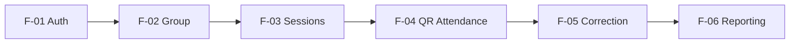

# PRD Index — kkndesakuncir

**Document Version**: 1.1.0  
**Last Updated**: 2026-07-31  
**Status**: Approved Baseline

## Feature Registry

| ID | Feature | File | Priority | Status | Owner Agent | Dependencies |
|---|---|---|---|---|---|---|
| F-01 | Authentication & Account Provisioning | `AUTH.md` | P0 | Approved | Fullstack | Cloudflare Worker + D1 + Better Auth |
| F-02 | Group & Student Management | `GROUP_MANAGEMENT.md` | P0 | Approved | Fullstack | F-01 |
| F-03 | Daily & Event Sessions | `ATTENDANCE_SESSION.md` | P0 | Approved | Fullstack | F-01, F-02 |
| F-04 | QR Attendance | `QR_ATTENDANCE.md` | P0 | Approved | Fullstack | F-01, F-02, F-03 |
| F-05 | Correction & Audit | `ATTENDANCE_CORRECTION.md` | P0 | Approved | Backend + Frontend | F-04 |
| F-06 | Reporting & Export | `REPORTING.md` | P0 | Approved | Fullstack | F-03, F-04, F-05 |

## Recommended Implementation Order

## P0 Completeness Check

| Feature | UI Defined | API Defined | Data Model Defined | Tests Defined | Tasks Referenced |
|---|---:|---:|---:|---:|---:|
| Authentication | ✅ | ✅ | ✅ | ✅ | ✅ |
| Group Management | ✅ | ✅ | ✅ | ✅ | ✅ |
| Sessions | ✅ | ✅ | ✅ | ✅ | ✅ |
| QR Attendance | ✅ | ✅ | ✅ | ✅ | ✅ |
| Correction | ✅ | ✅ | ✅ | ✅ | ✅ |
| Reporting | ✅ | ✅ | ✅ | ✅ | ✅ |

## Cloudflare Platform Baseline

Semua fitur memakai Cloudflare Workers, D1, Better Auth, dan server-side authorization sesuai `ARCHITECTURE.md`, `ERD.md`, dan `PERMISSION.md`. Tidak ada feature agent yang boleh membuat database/client access langsung dari browser.
