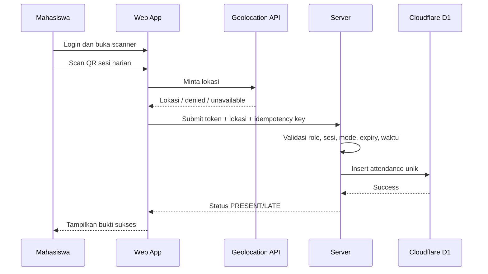

# SRS — Software Requirements Specification: kkndesakuncir

**Document Version**: 1.1.0  
**Last Updated**: 2026-07-31  
**Status**: Approved Baseline

## 1. Purpose

Dokumen ini mendefinisikan kebutuhan fungsional dan nonfungsional website absensi `kkndesakuncir` untuk satu kelompok KKN.

## 2. User Personas

### 2.1 Admin / Ketua KKN

- **Goal**: mencatat kehadiran cepat dan menghasilkan rekap yang terpercaya.
- **Pain points**: pencatatan manual lambat, data ganda, sulit menelusuri perubahan.
- **Device**: HP Android dan laptop.
- **Needs**: scanner cepat, daftar real-time, koreksi, ekspor.

### 2.2 Mahasiswa

- **Goal**: melakukan absensi dengan cepat dan melihat riwayatnya.
- **Pain points**: sinyal lemah, izin kamera/lokasi, tidak tahu apakah submit berhasil.
- **Device**: mayoritas HP Android.
- **Needs**: UI sederhana, konfirmasi jelas, QR pribadi yang mudah dibuka.

## 3. Functional Requirements

### 3.1 P0 — Must Have

#### FR-AUTH

- `FR-AUTH-001`: User dapat login menggunakan identitas dan password yang dibuat Admin.
- `FR-AUTH-002`: Sistem membedakan role `ADMIN` dan `STUDENT`.
- `FR-AUTH-003`: User hanya dapat mengakses route sesuai role.
- `FR-AUTH-004`: Admin dapat membuat, menonaktifkan, dan mereset akun mahasiswa.
- `FR-AUTH-005`: Mahasiswa wajib mengganti password awal saat login pertama.

#### FR-GROUP

- `FR-GROUP-001`: Admin dapat mengatur nama kelompok, desa, kecamatan, kabupaten, dan periode.
- `FR-GROUP-002`: Sistem hanya memiliki satu kelompok aktif pada MVP.
- `FR-GROUP-003`: Admin dapat mengimpor mahasiswa dari CSV.
- `FR-GROUP-004`: Admin dapat mengatur jadwal default absensi harian, batas terlambat, dan mode default.

#### FR-SESSION

- `FR-SESSION-001`: Admin dapat membuat sesi tipe `DAILY` atau `EVENT`.
- `FR-SESSION-002`: Sesi `DAILY` terikat pada satu tanggal dan maksimal satu per tanggal.
- `FR-SESSION-003`: Sesi `EVENT` memiliki nama kegiatan, tanggal, waktu mulai, dan waktu selesai.
- `FR-SESSION-004`: Admin memilih mode `SELF_SCAN`, `ADMIN_SCAN`, atau `HYBRID`.
- `FR-SESSION-005`: Admin dapat membuka, menutup, atau membatalkan sesi.
- `FR-SESSION-006`: Admin dapat mengatur batas keterlambatan.
- `FR-SESSION-007`: Sistem otomatis membuat satu sesi harian per tanggal selama periode KKN berdasarkan konfigurasi kelompok.
- `FR-SESSION-008`: Proses auto-create bersifat idempotent dan Admin dapat membuat sesi harian manual bila belum tersedia.

#### FR-QR

- `FR-QR-001`: Sistem menghasilkan QR sesi bertoken dan memiliki expiry.
- `FR-QR-002`: Mahasiswa dapat scan QR sesi hanya setelah login.
- `FR-QR-003`: Saat self-scan, sistem wajib memperoleh lokasi browser dan menyimpan hasilnya.
- `FR-QR-004`: Penolakan/ketidaktersediaan lokasi menggagalkan self-scan dan UI mengarahkan mahasiswa menggunakan Admin scan.
- `FR-QR-005`: Sistem menghasilkan QR identitas unik untuk setiap mahasiswa.
- `FR-QR-006`: Admin dapat scan QR mahasiswa pada sesi aktif.
- `FR-QR-007`: Sistem menolak catatan kedua untuk mahasiswa dan sesi yang sama.
- `FR-QR-008`: Timestamp absensi menggunakan waktu server.

#### FR-ATTENDANCE

- `FR-ATT-001`: Status kehadiran mendukung `PRESENT`, `LATE`, `PERMITTED`, `SICK`, `ABSENT`.
- `FR-ATT-002`: Status `PRESENT` atau `LATE` ditentukan otomatis berdasarkan batas keterlambatan.
- `FR-ATT-003`: Mahasiswa dapat melihat riwayat miliknya sendiri.
- `FR-ATT-004`: Admin dapat melihat seluruh data kehadiran.
- `FR-ATT-005`: Setiap catatan menyimpan metode pencatatan.

#### FR-CORRECTION

- `FR-COR-001`: Admin dapat menambah catatan manual dengan alasan wajib.
- `FR-COR-002`: Admin dapat mengubah status catatan dengan alasan wajib.
- `FR-COR-003`: Sistem menyimpan nilai lama, nilai baru, pelaku, alasan, dan waktu perubahan.
- `FR-COR-004`: Audit log tidak dapat diubah melalui UI.

#### FR-REPORT

- `FR-REP-001`: Admin dapat memfilter berdasarkan tanggal, tipe sesi, kegiatan, mahasiswa, dan status.
- `FR-REP-002`: Admin dapat mengunduh CSV.
- `FR-REP-003`: Rekap menampilkan jumlah hadir, terlambat, izin, sakit, dan alpa.

### 3.2 P1 — Should Have

- Pengajuan izin/sakit oleh mahasiswa dengan lampiran.
- PWA installable.
- Rotasi QR sesi otomatis setiap 30–60 detik.
- Export XLSX/PDF.
- Notifikasi in-app ketika sesi aktif.
- Offline queue terbatas pada admin scanner.

### 3.3 P2 — Nice to Have

- Multi-kelompok dan multi-periode.
- Dosen pembimbing.
- Geofencing radius.
- Analitik tren kehadiran.
- Integrasi WhatsApp/email.

## 4. Non-Functional Requirements

### 4.1 Performance

- `NFR-PERF-001`: p95 response API read sederhana ≤ 800 ms pada kondisi normal.
- `NFR-PERF-002`: p95 submit absensi ≤ 2 detik tidak termasuk waktu izin lokasi browser.
- `NFR-PERF-003`: halaman utama interaktif ≤ 3 detik pada koneksi 4G wajar.
- `NFR-PERF-004`: scanner dapat memproses scan berikutnya ≤ 1 detik setelah hasil sukses tampil.

### 4.2 Reliability

- `NFR-REL-001`: target uptime MVP 99.5% bulanan.
- `NFR-REL-002`: unique constraint database mencegah duplikasi.
- `NFR-REL-003`: submit dapat diulang secara aman menggunakan idempotency key.

### 4.3 Security

- `NFR-SEC-001`: seluruh traffic produksi menggunakan HTTPS.
- `NFR-SEC-002`: QR tidak memuat NIM, email, atau primary key mentah.
- `NFR-SEC-003`: token QR sesi ditandatangani dan memiliki expiry.
- `NFR-SEC-004`: endpoint mutasi memiliki rate limit.
- `NFR-SEC-005`: data hanya diakses melalui Worker; setiap query menerapkan RBAC dan ownership filtering di server.
- `NFR-SEC-006`: password dan token tidak pernah ditulis ke log.
- `NFR-SEC-007`: audit log append-only dari sisi aplikasi.

### 4.4 Privacy

- `NFR-PRIV-001`: lokasi hanya direkam untuk menyelesaikan submit self-scan.
- `NFR-PRIV-002`: UI menjelaskan tujuan pengambilan lokasi.
- `NFR-PRIV-003`: koordinat presisi hanya dapat dilihat Admin; Mahasiswa hanya melihat bahwa lokasi berhasil direkam.
- `NFR-PRIV-004`: latitude/longitude tidak disertakan dalam ekspor publik kecuali admin memilih secara eksplisit.

### 4.5 Platform & Deployment

- `NFR-PLAT-001`: aplikasi harus dapat dibuild dengan `@opennextjs/cloudflare`.
- `NFR-PLAT-002`: production runtime hanya memakai Cloudflare Workers; tidak ada dependency Vercel atau Supabase.
- `NFR-PLAT-003`: seluruh schema change disimpan sebagai migration D1 yang versioned.
- `NFR-PLAT-004`: push ke branch `main` pada repo `syihab-zuhri/kknkuncir2026` memicu deployment produksi melalui Workers Builds.
- `NFR-PLAT-005`: aplikasi produksi tersedia melalui `https://zuhrirey.my.id`.
- `NFR-PLAT-006`: binding D1/R2/rate limiter tidak boleh diganti dengan REST credential di browser.

### 4.6 Accessibility

- Target WCAG 2.2 Level AA untuk alur utama.
- Semua form memiliki label.
- Status tidak hanya dibedakan oleh warna.
- Scanner menyediakan fallback input manual kode QR.

### 4.7 Compatibility

- Chrome Android dua versi mayor terbaru.
- Safari iOS dua versi mayor terbaru.
- Chrome/Edge desktop dua versi mayor terbaru.

### 4.8 Maintainability

- TypeScript strict mode.
- Schema validation pada boundary API.
- Minimum coverage unit test modul domain 80%.
- Seluruh error memiliki code terstruktur.

## 5. User Journeys

### 5.1 Mahasiswa — Self Scan Harian

#### Edge Cases

- QR kedaluwarsa → minta scan ulang.
- Sesi ditutup → tolak dengan pesan jelas.
- Sudah absen → tampilkan catatan yang sudah ada, bukan error ambigu.
- Lokasi ditolak/tidak tersedia → self-scan tidak diproses; tampilkan pilihan coba lagi atau tunjukkan QR pribadi kepada Admin.
- Request timeout → tombol coba lagi menggunakan idempotency key sama.

### 5.2 Admin — Scan QR Mahasiswa

1. Admin membuat atau memilih sesi aktif.
2. Admin membuka scanner.
3. Mahasiswa menunjukkan QR pribadi.
4. Admin scan secara berurutan.
5. Sistem memvalidasi mahasiswa aktif dan belum tercatat.
6. UI menampilkan nama, NIM, dan status sukses.
7. Scanner siap untuk mahasiswa berikutnya.

### 5.3 Admin — Koreksi

1. Admin membuka detail catatan.
2. Memilih status baru.
3. Mengisi alasan.
4. Sistem menyimpan perubahan dan audit log dalam satu transaksi.
5. Riwayat perubahan terlihat di detail.

## 6. Business Rules

- `BR-001`: Satu mahasiswa hanya memiliki satu attendance per sesi.
- `BR-002`: Satu tanggal hanya memiliki satu sesi `DAILY` yang tidak dibatalkan.
- `BR-003`: `SELF_SCAN` hanya valid untuk sesi mode `SELF_SCAN` atau `HYBRID`.
- `BR-004`: `ADMIN_SCAN` hanya valid untuk sesi mode `ADMIN_SCAN` atau `HYBRID`.
- `BR-005`: Waktu status terlambat dihitung dari `late_after` server.
- `BR-006`: Koordinat wajib untuk `SELF_SCAN`, tetapi tidak dinilai terhadap radius/geofence pada MVP.
- `BR-007`: Perubahan manual wajib memiliki alasan minimal 10 karakter.
- `BR-008`: Akun mahasiswa nonaktif tidak dapat login atau discan.
- `BR-009`: Sesi yang dibatalkan tidak boleh menerima attendance baru.

## 7. Out of Scope MVP

- Face recognition.
- Fingerprint hardware.
- Aplikasi Android/iOS native.
- Multi-universitas.
- Payroll atau penilaian akademik otomatis.
- Geofence yang memblokir attendance.
- Check-out.
- Integrasi SSO kampus.

## 8. Traceability Matrix

| P0 Feature | PRD | ERD Tables | Primary API |
|---|---|---|---|
| Authentication | `PRD/AUTH.md` | Better Auth `user`, `students` | `/api/v1/auth/*` |
| Group management | `PRD/GROUP_MANAGEMENT.md` | `group_settings`, `students` | `/api/v1/group`, `/api/v1/students` |
| Attendance sessions | `PRD/ATTENDANCE_SESSION.md` | `attendance_sessions` | `/api/v1/sessions` |
| QR attendance | `PRD/QR_ATTENDANCE.md` | `qr_credentials`, `attendance_records` | `/api/v1/attendance/self-scan`, `/admin-scan` |
| Corrections | `PRD/ATTENDANCE_CORRECTION.md` | `attendance_records`, `attendance_audits` | `/api/v1/attendance/:id` |
| Reporting | `PRD/REPORTING.md` | session and attendance views | `/api/v1/reports/attendance` |
