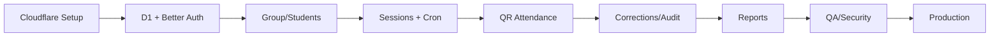

# TASKS — Execution Checklist: kkndesakuncir

**Document Version**: 1.3.0
**Last Updated**: 2026-08-01
**Status**: Phase 0–1 Complete; Phase 2 Pending
**Target Repository**: `https://github.com/syihab-zuhri/kknkuncir2026.git`

Effort: `[S]` <2 jam, `[M]` 2–8 jam, `[L]` >8 jam.

## Phase 0 — Repository, Cloudflare, and Project Setup

- [x] `[S]` Clone atau inisialisasi repo `syihab-zuhri/kknkuncir2026` dan pastikan branch `main` aktif. `(ref: DEPLOYMENT.md)`
- [x] `[S]` Bootstrap Next.js App Router + TypeScript + Tailwind CSS.
- [x] `[S]` Tambahkan `.nvmrc`/`engines`, ESLint, Prettier, dan strict TypeScript.
- [x] `[S]` Install serta konfigurasi `@opennextjs/cloudflare` dan Wrangler. `(ref: ARCHITECTURE.md)`
- [x] `[S]` Buat `open-next.config.ts` dan scripts `cf:build`, `preview`, `deploy`.
- [x] `[S]` Buat `wrangler.jsonc` dengan Worker name `kknkuncir2026`.
- [x] `[S]` Buat D1 production `kknkuncir2026-db` dan preview database. `(ref: DEPLOYMENT.md)`
- [x] `[S]` Deklarasikan binding `DB`, static assets, dan rate limiters; tunda Cron sampai scheduled handler Phase 3 tersedia.
- [x] `[S]` Buat `.dev.vars.example`, `.gitignore`, dan typed Cloudflare environment. `(ref: credential.md)`
- [x] `[S]` Aktifkan Workers Logs, Traces, dan source maps.
- [x] `[S]` Hubungkan Workers Builds ke repo GitHub branch `main`.
- [x] `[S]` Konfigurasi custom domain `zuhrirey.my.id` setelah Worker sehat.
- [x] `[M]` Setup Vitest, Playwright, test database, dan basic CI checks.

> Status 2026-08-01: seluruh Phase 0 dan Phase 1 selesai. Schema/auth migration sudah diterapkan ke D1 lokal dan preview saja; D1 production dan Worker production belum diubah oleh Phase 1.

## Phase 1 — D1 Schema and Authentication

- [x] `[S]` Install Drizzle ORM/Kit dan buat D1 client wrapper.
- [x] `[M]` Implement schema Better Auth dengan D1 adapter. `(ref: PRD/AUTH.md, ERD.md)`
- [x] `[S]` Aktifkan Better Auth Username plugin dan Admin plugin.
- [x] `[M]` Implement app tables: `group_settings`, `students`, `qr_credentials`.
- [x] `[L]` Implement attendance tables, indexes, constraints, dan atomic audit strategy. `(ref: ERD.md)`
- [x] `[S]` Generate dan review migration SQL.
- [x] `[S]` Apply migration ke local D1 dan preview D1.
- [x] `[M]` Implement Better Auth server config dan secure cookie settings.
- [x] `[M]` Implement login menggunakan NIM sebagai username.
- [x] `[M]` Implement Admin bootstrap yang idempotent dan hanya aktif pada setup awal.
- [x] `[M]` Implement create student account dengan internal email `<nim>@users.zuhrirey.my.id`.
- [x] `[M]` Implement first-login forced password change.
- [x] `[M]` Implement reset password, deactivate/ban, dan revoke sessions.
- [x] `[M]` Implement route guards serta server-side RBAC. `(ref: PERMISSION.md)`
- [x] `[M]` Implement login rate limiting dan generic auth errors.
- [x] `[M]` Tambahkan audit log untuk provisioning/reset/deactivation.

## Phase 2 — Group and Student Management

- [ ] `[M]` Implement single-group settings repository/service. `(ref: PRD/GROUP_MANAGEMENT.md)`
- [ ] `[M]` Implement Admin group settings UI.
- [ ] `[M]` Implement student list/search/detail UI.
- [ ] `[M]` Implement create/edit/deactivate student flow.
- [ ] `[L]` Implement CSV import dengan dry-run validation dan per-row result.
- [ ] `[M]` Implement ownership-scoped student profile endpoint.
- [ ] `[S]` Seed initial group `KKN Desa Kuncir 2026`.

## Phase 3 — Attendance Sessions and Scheduler

- [ ] `[M]` Implement session schema validation dan service lifecycle. `(ref: PRD/ATTENDANCE_SESSION.md)`
- [ ] `[M]` Implement create/edit/open/close/cancel endpoints.
- [ ] `[M]` Implement daily session uniqueness handling.
- [ ] `[M]` Implement Cloudflare scheduled handler pada `5 * * * *`.
- [ ] `[M]` Implement Asia/Jakarta date/time conversion utility.
- [ ] `[M]` Implement idempotent daily session auto-create.
- [ ] `[S]` Implement auto-close expired sessions.
- [ ] `[L]` Implement Admin session list/create/detail UI.
- [ ] `[M]` Implement Student active-session cards.

## Phase 4 — QR Attendance Core

- [ ] `[M]` Implement signed session QR token service dengan Web Crypto. `(ref: PRD/QR_ATTENDANCE.md)`
- [ ] `[S]` Implement QR version rotation dan 5-minute expiry.
- [ ] `[M]` Implement student opaque QR credential generation/hash/rotation.
- [ ] `[L]` Implement self-scan endpoint dengan auth, location validation, time/mode checks, dan idempotency.
- [ ] `[L]` Implement Admin-scan endpoint dengan continuous scan behavior.
- [ ] `[M]` Implement D1 atomic batch dan unique-conflict deterministic response.
- [ ] `[M]` Implement attendance rate limiting.
- [ ] `[L]` Implement mobile camera scanner dengan cleanup dan permission fallbacks.
- [ ] `[M]` Implement browser geolocation capture, accuracy display, dan timeout handling.
- [ ] `[M]` Implement “Tampilkan QR Saya ke Admin” fallback.
- [ ] `[M]` Implement session QR presentation dengan countdown dan fullscreen.
- [ ] `[M]` Implement success/duplicate/late/error result cards.

## Phase 5 — Corrections, Audit, and Reporting

- [ ] `[M]` Implement manual attendance dengan mandatory reason. `(ref: PRD/ATTENDANCE_CORRECTION.md)`
- [ ] `[M]` Implement optimistic correction memakai `expectedRevision`.
- [ ] `[M]` Verify D1 batch dan conditional audit insert selalu konsisten.
- [ ] `[M]` Implement Admin audit timeline UI.
- [ ] `[M]` Implement dashboard summary queries. `(ref: PRD/REPORTING.md)`
- [ ] `[L]` Implement reports filters, pagination, missing-student calculation.
- [ ] `[M]` Implement Student own history query dengan ownership scope.
- [ ] `[M]` Implement CSV export dengan UTF-8 BOM dan formula-injection protection.
- [ ] `[S]` Pastikan location columns opt-in pada export.

## Phase 6 — Design System and UX Hardening

- [ ] `[M]` Implement design tokens dan typography. `(ref: DSD.md)`
- [ ] `[M]` Implement Button, Input, Badge, Dialog, Toast, Empty/Error states.
- [ ] `[M]` Implement responsive Admin sidebar/drawer dan Student bottom navigation.
- [ ] `[M]` Implement accessible focus management dan scanner announcements.
- [ ] `[S]` Add `Permissions-Policy` untuk camera/geolocation same-origin.
- [ ] `[M]` Add Content Security Policy baseline compatible dengan app.
- [ ] `[M]` Audit WCAG 2.2 AA critical flows.

## Phase 7 — Testing and Security Validation

- [ ] `[M]` Unit tests: auth validation, QR sign/verify, time boundaries, location payload.
- [ ] `[M]` Unit tests: CSV escaping, report aggregation, group period validation.
- [ ] `[L]` Integration tests: account provisioning dan session revocation.
- [ ] `[L]` Integration tests: daily Cron idempotency.
- [ ] `[L]` Integration tests: concurrent attendance menghasilkan satu record.
- [ ] `[M]` Integration tests: D1 batch rollback dan correction audit.
- [ ] `[L]` Authorization tests: Student cannot read another Student via modified IDs.
- [ ] `[M]` Authorization tests: inactive/banned account and role escalation rejected.
- [ ] `[L]` E2E mobile: self-scan location success/denied/fallback.
- [ ] `[L]` E2E Admin continuous scanner dan duplicate handling.
- [ ] `[M]` E2E report/filter/export.
- [ ] `[M]` Load test skala target dan Admin scan burst.
- [ ] `[S]` Dependency audit dan secret scan.

## Phase 8 — Production Deployment

- [ ] `[S]` Review production `wrangler.jsonc`. `(ref: DEPLOYMENT.md)`
- [ ] `[S]` Set Worker secrets melalui Wrangler.
- [ ] `[S]` Apply production D1 migrations setelah backup bookmark dicatat.
- [ ] `[S]` Push tested commit ke `main` dan verify Workers Build.
- [ ] `[S]` Verify Worker deployment before attaching domain.
- [ ] `[S]` Attach custom domain `zuhrirey.my.id`.
- [ ] `[M]` Execute complete smoke test checklist.
- [ ] `[S]` Change bootstrap Admin password dan revoke bootstrap sessions.
- [ ] `[S]` Verify Cron execution in Workers Logs.
- [ ] `[S]` Verify logs contain request IDs and no secrets/precise location.
- [ ] `[S]` Record current healthy Worker version and D1 recovery point.

## Phase 9 — Post-Launch P1/P2

- [ ] `[M]` Add R2 bucket and private evidence upload flow for izin/sakit.
- [ ] `[M]` Add attachment retention/deletion policy.
- [ ] `[M]` Add notification/reminder system if required.
- [ ] `[L]` Add offline-tolerant admin scan queue only after conflict model is designed.
- [ ] `[L]` Add multi-group support only after updating PERMISSION, ERD, and every affected PRD.
- [ ] `[M]` Evaluate database migration only if D1 constraints become measurable bottlenecks.

## Critical Dependency Graph

## Definition of Done

A task is complete only when:

- implementation matches its PRD acceptance criteria;
- authorization is enforced server-side;
- D1 constraints/migrations are committed;
- loading, empty, error, and success states exist where relevant;
- tests cover happy path and critical edge cases;
- documentation and `CHANGELOG.md` are updated when contracts change.
